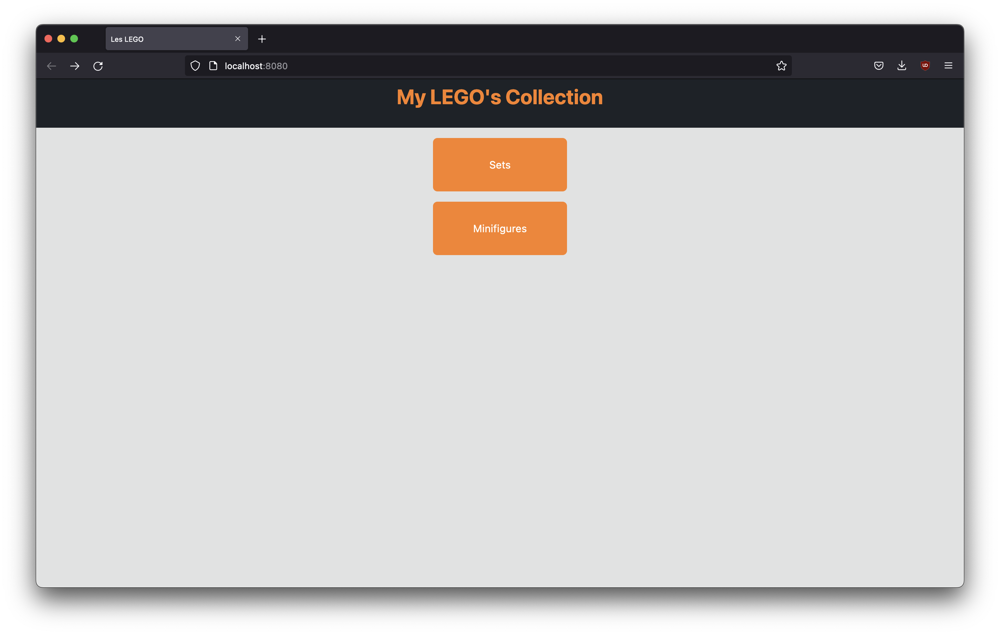
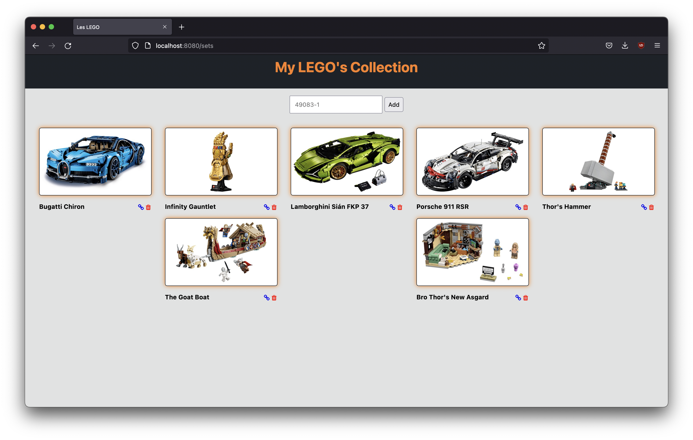
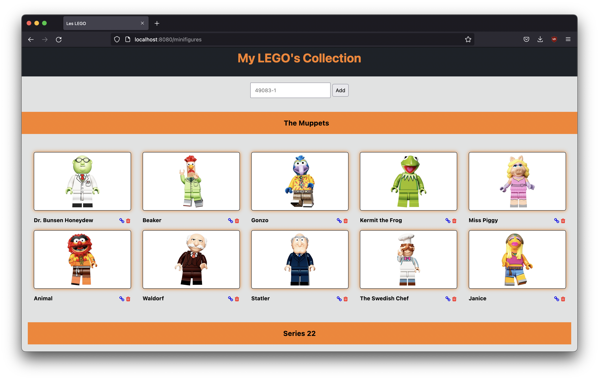

# Lego Tracker

A simple local web-based app to track your Lego's collection.

## Screenshots

## Requirements

Required Python packages : Bottle & DotEnv
A brickset account with API credentials

